# Mapa normativo gerado

Origem: `14b3c6b4ef2c16aa4ba17ff93f601ab9328cdcb9daf579a8c4d38031b7deb3b4`; revisão: `7b9fd6c`; tokenizer: `tiktoken 0.13.0` / `o200k_base` / `gpt-4o`.

Custos são tokens acumulados do conteúdo efetivamente carregado. Aresta passiva lê o nó integral; imediata lê até seu marcador inclusivo; folha e híbrido terminal incluem conteúdo integral; rotas distintas permanecem separadas e um nó compartilhado não é contado duas vezes na mesma rota.

```mermaid
flowchart TD
  core_agents["core.agents\nhybrid\n399 tokens"]
  core_agents_full["core.agents-full\nleaf\n8058 tokens"]
  core_authority["core.authority\nleaf\n1130 tokens"]
  core_microconcepts["core.microconcepts\nleaf\n3433 tokens"]
  core_contracts["core.contracts\nleaf\n2069 tokens"]
  core_routing["core.routing\nleaf\n1833 tokens"]
  core_update["core.update\nleaf\n2172 tokens"]
  role_final["role.final\nleaf\n663 tokens"]
  role_constructor["role.constructor\nderivation\n930 tokens"]
  scenario_constructor_operation["scenario.constructor-operation\nleaf\n902 tokens"]
  resource_scripts["resource.scripts\nhybrid\n1467 tokens"]
  resource_skills["resource.skills\nleaf\n561 tokens"]
  resource_subagents["resource.subagents\nleaf\n516 tokens"]
  resource_long_running["resource.long-running\nleaf\n511 tokens"]
  resource_external_tools["resource.external-tools\nleaf\n425 tokens"]
  resource_workflows["resource.workflows\nleaf\n873 tokens"]
  resource_traceability["resource.traceability\nleaf\n965 tokens"]
  scenario_request_lifecycle["scenario.request-lifecycle\nhybrid\n888 tokens"]
  scenario_state_and_todo["scenario.state-and-todo\nleaf\n946 tokens"]
  scenario_refused_decisions["scenario.refused-decisions\nleaf\n1201 tokens"]
  scenario_official_gap["scenario.official-gap\nleaf\n555 tokens"]
  scenario_upstream_sharing["scenario.upstream-sharing\nhybrid\n1198 tokens"]
  scenario_issue_lifecycle["scenario.issue-lifecycle\nleaf\n441 tokens"]
  scenario_release["scenario.release\nhybrid\n1268 tokens"]
  capability_package_registry["capability.package-registry\nleaf\n457 tokens"]
  scenario_application_update["scenario.application-update\nleaf\n398 tokens"]
  scenario_content_publication["scenario.content-publication\nleaf\n422 tokens"]
  scenario_web_page_like["scenario.web-page-like\nhybrid\n388 tokens"]
  capability_web_browser["capability.web-browser\nleaf\n1401 tokens"]
  capability_web_static["capability.web-static\nleaf\n282 tokens"]
  capability_web_editorial["capability.web-editorial\nleaf\n1067 tokens"]
  scenario_visual_precision["scenario.visual-precision\nleaf\n453 tokens"]
  meta_cli["meta.cli\nleaf\n139 tokens"]
  meta_build["meta.build\nleaf\n237 tokens"]
  meta_ia["meta.ia\nleaf\n107 tokens"]
  meta_maintenance["meta.maintenance\nleaf\n100 tokens"]
  meta_publish["meta.publish\nleaf\n135 tokens"]
  meta_release["meta.release\nleaf\n161 tokens"]
  meta_update["meta.update\nleaf\n201 tokens"]
  meta_upstream["meta.upstream\nleaf\n129 tokens"]
  meta_validation["meta.validation\nleaf\n99 tokens"]
  bootstrap_init_repo["bootstrap.init-repo\nleaf\n2977 tokens"]
  core_agents -->|"passive: always"| core_authority
  core_agents -->|"passive: partial-context or discovery"| core_routing
  core_agents -->|"passive: MN-* reference or ambiguity"| core_microconcepts
  core_agents -->|"passive: scenario, resource, hook, integration or manifest"| core_contracts
  core_agents -->|"passive: always in a consuming repository"| role_final
  core_agents -->|"passive: constructor operation"| role_constructor
  role_constructor -->|"passive: source, classification, build, dist, package, archive, update, distribution, release or publish"| scenario_constructor_operation
  core_agents -->|"passive: request intake or resume"| scenario_request_lifecycle
  scenario_request_lifecycle -->|"passive: every new request after source capture and before substantive analysis"| scenario_refused_decisions
  core_agents -->|"passive: apparent official gap"| scenario_official_gap
  core_agents -->|"passive: upstream proposal or inbox"| scenario_upstream_sharing
  scenario_upstream_sharing -->|"passive: constructor receives human-approved issue"| scenario_issue_lifecycle
  core_agents -->|"passive: governance install, update, repair or migration"| core_update
  core_agents -->|"passive: script, command, runtime, hook, callback, fallback or adapter"| resource_scripts
  resource_scripts -->|"passive: reusable CLI"| meta_cli
  core_agents -->|"passive: distributable workflow"| resource_workflows
  core_agents -->|"passive: technical unit or material traceability"| resource_traceability
  core_agents -->|"passive: release"| scenario_release
  scenario_release -->|"passive: RCF opts into package registry"| capability_package_registry
  core_agents -->|"passive: RCF opts into application update"| scenario_application_update
  core_agents -->|"passive: business content publication"| scenario_content_publication
  core_agents -->|"passive: web page like product"| scenario_web_page_like
  scenario_web_page_like -->|"passive: browser capability"| capability_web_browser
  scenario_web_page_like -->|"passive: static hosting capability"| capability_web_static
  scenario_web_page_like -->|"passive: editorial capability"| capability_web_editorial
  core_agents -->|"passive: build, dist, package or archive"| meta_build
  core_agents -->|"passive: agent command or AI output"| meta_ia
  core_agents -->|"passive: maintenance"| meta_maintenance
  core_agents -->|"passive: publish or deploy"| meta_publish
  core_agents -->|"passive: release execution"| meta_release
  core_agents -->|"passive: update:agents execution"| meta_update
  core_agents -->|"passive: upstream operation"| meta_upstream
  core_agents -->|"passive: validation"| meta_validation
  core_agents -->|"passive: repository normative bootstrap"| bootstrap_init_repo
  core_agents -->|"passive: route change, context loss, normative conflict, rule not found, invalid index/cache, preservation audit or low confidence"| core_agents_full
  core_agents -->|"passive: skill evaluation, discovery, lifecycle or validation"| resource_skills
  core_agents -->|"passive: subagent evaluation, delegation, lifecycle or validation"| resource_subagents
  core_agents -->|"passive: long-running operation, timeout, wait, cancellation, resume or orphan"| resource_long_running
  core_agents -->|"passive: third-party, MCP, plugin, external tool or external service"| resource_external_tools
  core_agents -->|"passive: state, memory, fix, TODO, migration or resume"| scenario_state_and_todo
  core_agents -->|"passive: visual image, PDF, screenshot, render or responsive UI work"| scenario_visual_precision
```

## Resumo

O desvio padrão é populacional e considera uma observação por rota válida.

| Terminal | Rotas | Mínimo | Média | Mediana | Desvio padrão | Máximo |
|---|---:|---:|---:|---:|---:|---:|
| Folha | 35 | 498 | 1625.69 | 1069 | 1447.8 | 8457 |
| Híbrido | 6 | 399 | 1267.17 | 1442.0 | 518.32 | 1866 |

## Caminhos

| ID | Rota | Terminal | Tokens |
|---|---|---|---:|
| path-001 | core.agents | hybrid | 399 |
| path-002 | core.agents → core.authority | leaf | 1529 |
| path-003 | core.agents → core.routing | leaf | 2232 |
| path-004 | core.agents → core.microconcepts | leaf | 3832 |
| path-005 | core.agents → core.contracts | leaf | 2468 |
| path-006 | core.agents → role.final | leaf | 1062 |
| path-007 | core.agents → role.constructor → scenario.constructor-operation | leaf | 2231 |
| path-008 | core.agents → scenario.request-lifecycle | hybrid | 1287 |
| path-009 | core.agents → scenario.request-lifecycle → scenario.refused-decisions | leaf | 2488 |
| path-010 | core.agents → scenario.official-gap | leaf | 954 |
| path-011 | core.agents → scenario.upstream-sharing | hybrid | 1597 |
| path-012 | core.agents → scenario.upstream-sharing → scenario.issue-lifecycle | leaf | 2038 |
| path-013 | core.agents → core.update | leaf | 2571 |
| path-014 | core.agents → resource.scripts | hybrid | 1866 |
| path-015 | core.agents → resource.scripts → meta.cli | leaf | 2005 |
| path-016 | core.agents → resource.workflows | leaf | 1272 |
| path-017 | core.agents → resource.traceability | leaf | 1364 |
| path-018 | core.agents → scenario.release | hybrid | 1667 |
| path-019 | core.agents → scenario.release → capability.package-registry | leaf | 2124 |
| path-020 | core.agents → scenario.application-update | leaf | 797 |
| path-021 | core.agents → scenario.content-publication | leaf | 821 |
| path-022 | core.agents → scenario.web-page-like | hybrid | 787 |
| path-023 | core.agents → scenario.web-page-like → capability.web-browser | leaf | 2188 |
| path-024 | core.agents → scenario.web-page-like → capability.web-static | leaf | 1069 |
| path-025 | core.agents → scenario.web-page-like → capability.web-editorial | leaf | 1854 |
| path-026 | core.agents → meta.build | leaf | 636 |
| path-027 | core.agents → meta.ia | leaf | 506 |
| path-028 | core.agents → meta.maintenance | leaf | 499 |
| path-029 | core.agents → meta.publish | leaf | 534 |
| path-030 | core.agents → meta.release | leaf | 560 |
| path-031 | core.agents → meta.update | leaf | 600 |
| path-032 | core.agents → meta.upstream | leaf | 528 |
| path-033 | core.agents → meta.validation | leaf | 498 |
| path-034 | core.agents → bootstrap.init-repo | leaf | 3376 |
| path-035 | core.agents → resource.skills | leaf | 960 |
| path-036 | core.agents → resource.subagents | leaf | 915 |
| path-037 | core.agents → resource.long-running | leaf | 910 |
| path-038 | core.agents → resource.external-tools | leaf | 824 |
| path-039 | core.agents → scenario.state-and-todo | leaf | 1345 |
| path-040 | core.agents → scenario.visual-precision | leaf | 852 |
| path-041 | core.agents → core.agents-full | leaf | 8457 |
