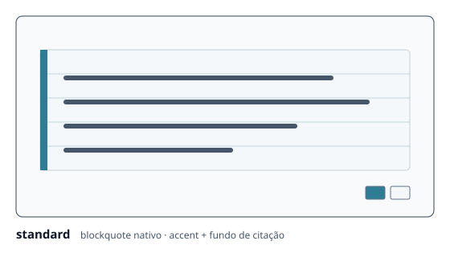
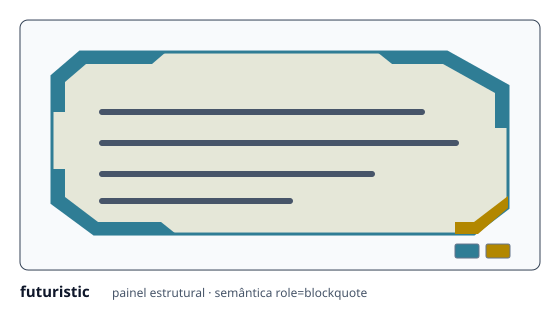
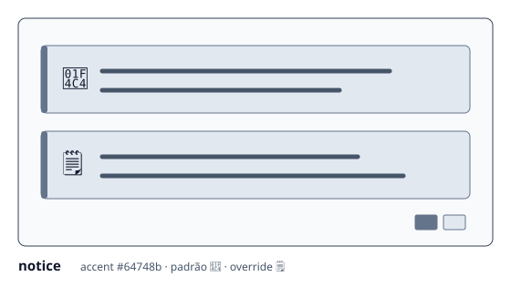
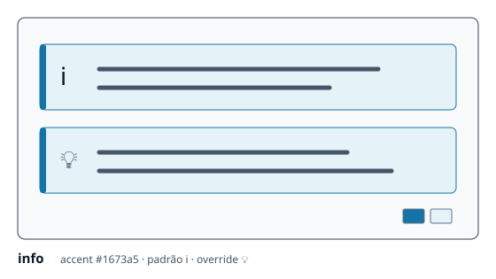
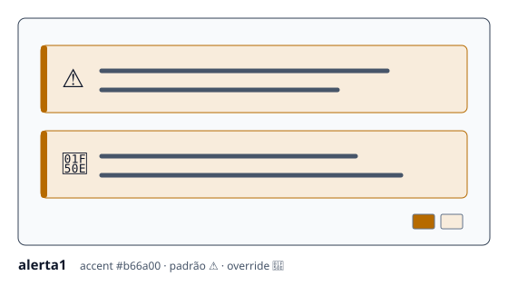
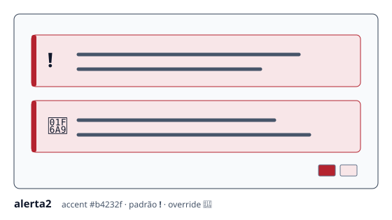

# Blockquote — uso, configuração e estilos

Página canônica de autoria subordinada ao [`RCF-JCEM-CITACOES-001`](../RCFs/citacoes.md) e derivada de [`config/editorial-quotes.json`](../config/editorial-quotes.json). O modelo descreve um bloco semântico de citação mesmo quando o renderer `futuristic` produz `div`, `table` e `role="blockquote"` no HTML final.

## Exemplo copiável e funcional

```markdown
> Uma documentação útil mostra a aplicação concreta do recurso.
>
> — Equipe editorial
{: data-jcem-quote-model="alerta1" data-jcem-quote-icon="🔎"}
```

A IAL do Kramdown deve vir imediatamente depois do bloco. O exemplo seleciona um modelo registrado e substitui seu ícone padrão por texto curto, sem depender de asset externo.

## Modelos registrados

| Modelo | Estrutura e aplicação | Aparência |
|---|---|---|
| `standard` | Mantém `<blockquote>`; usa fundo pautado e barra lateral de destaque. |  |
| `futuristic` | Renderer estrutural: painel decorativo com semântica preservada por `role="blockquote"` e `data-jcem-blockquote`. |  |
| `notice` | Aviso documental responsivo; ícone padrão `📄`. |  |
| `info` | Informação de uso responsiva; ícone padrão `ℹ️`. |  |
| `alerta1` | Revisão ou atenção editorial; ícone padrão `⚠️`. |  |
| `alerta2` | Ausência de referência ou alerta crítico; ícone padrão `❗`. |  |

As ilustrações tipadas mostram duas ocorrências do mesmo modelo — ícone padrão e override — e incluem a paleta real de destaque/superfície. As cores não são configuradas por nomes arbitrários: cada modelo possui um accent fixo no tema (`notice` `#64748b`, `info` `#1673a5`, `alerta1` `#b66a00`, `alerta2` `#b4232f`) sobre o fundo de citação claro ou escuro.

## Seleção e precedência

Sem atributo por ocorrência, o projeto resolve o estilo pelo artigo e pela configuração global:

```yaml
# _config.yml: padrão global futurista
jcem:
  blockquote_panels: true
```

No front matter de um artigo, use a mesma chave para escolher `futuristic` (`true`) ou `standard` (`false`):

```yaml
---
jcem:
  blockquote_panels: false
---
```

A ordem efetiva é: `data-jcem-quote-model` da ocorrência → `jcem.blockquote_panels` do artigo → `blockquote_panels` legado do artigo → `jcem.blockquote_panels` global → comportamento padrão do produto. O atributo por ocorrência aceita somente os seis identificadores do registro; nome desconhecido falha no build de fonte controlada.

## Autoria Markdown e HTML

Markdown comum continua usando `>`:

```markdown
> Conteúdo citado.
>
> — Autor ou referência
{: data-jcem-quote-model="futuristic"}
```

O formato canônico de autoria usa travessão. No início direto de uma linha de blockquote, o legado `--` seguido de espaço ou tab é normalizado para `—`; `---`, código, conteúdo inline e blocos aninhados não são alterados.

HTML equivalente deve carregar marcador semântico inequívoco. Para elementos que não sejam `<blockquote>`, declare também o papel acessível:

```html
<div data-jcem-blockquote data-jcem-quote-model="info" role="blockquote">
  <p>Informação preservada como citação estrutural.</p>
</div>
```

O aprimoramento em runtime reconhece `blockquote` e `[data-jcem-blockquote]`; sem JavaScript, a transformação estática dos posts Markdown mantém o conteúdo nativo legível.

## Ícones

Modelos `notice`, `info`, `alerta1` e `alerta2` aceitam dois formatos:

- `data-jcem-quote-icon="…"`: emoji ou texto curto; é decorativo e recebe `aria-hidden`;
- `data-jcem-quote-icon-src="…"` com `data-jcem-quote-icon-alt="…"`: imagem relativa segura do próprio site ou URL `https://`.

Exemplo com asset interno existente:

```markdown
> Referência ainda não localizada.
{: data-jcem-quote-model="alerta2" data-jcem-quote-icon-src="/assets/jcem/img/flagVermelho.svg" data-jcem-quote-icon-alt="Alerta"}
```

Não existe catálogo fechado de ícones internos: qualquer imagem pública versionada pode ser usada por path relativo seguro, sem `..`, e com texto alternativo. URL externa precisa ser HTTPS. Esquema executável, URL de rede iniciada por `//`, path com travessia ou imagem sem `alt` falha na validação.

## Tema, responsividade, acessibilidade e impressão

- Todos os modelos preservam conteúdo, links, notas, idioma, foco e ordem de leitura.
- Em telas estreitas, modelos tipados movem o ícone para uma linha própria sem truncar o texto.
- O `futuristic` muda a estrutura visual, mas conserva `data-jcem-blockquote` e `role="blockquote"`.
- Sem JavaScript, o HTML estático ou o `<blockquote>` nativo continuam legíveis.
- Na impressão, a decoração web é neutralizada e todos os modelos usam o perfil IEEE comum.

## Citações inline e subcitações

Aspas retas ou tipográficas em texto elegível recebem ênfase semântica sem perder delimitadores. Backticks continuam sendo código; quando representarem citação, declare a classe explicitamente:

```markdown
`conteúdo citado`{: .jcem-inline-quote}
```

Subcitação imediata usa somente itálico. Profundidades adicionais podem receber fundo discreto e um segundo indício visual, sem herdar a borda do bloco externo.

## Manutenção

Mudança de modelo, identificador, classe, estrutura, sintaxe, precedência, cor ou ícone padrão exige atualização conjunta do registro, do RCF, desta página, da ilustração correspondente e da validação documental.
