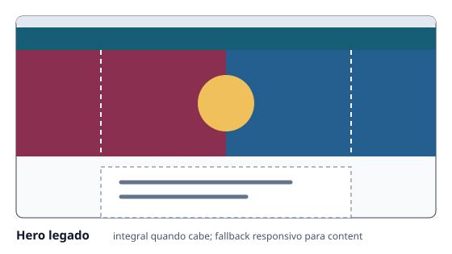
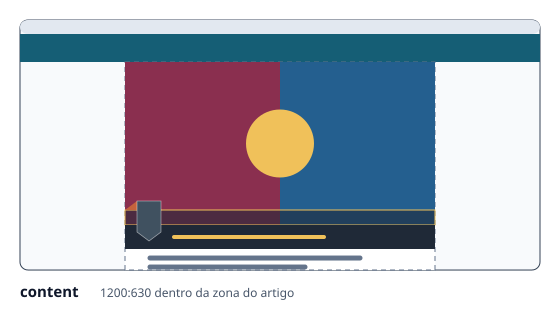
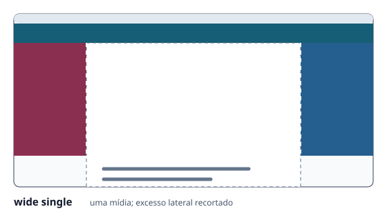
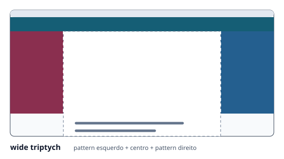
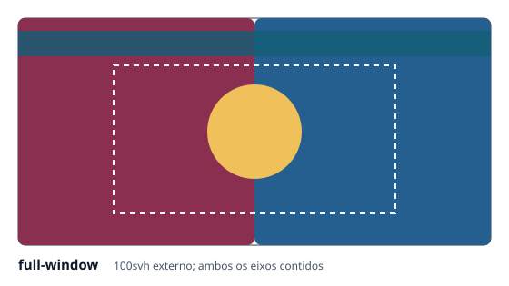
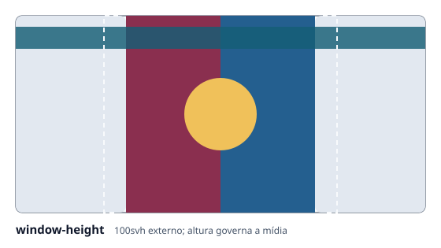
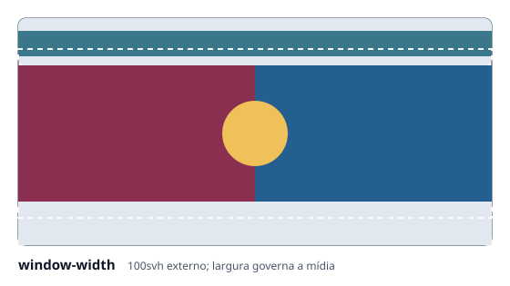
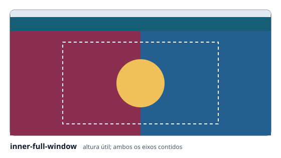
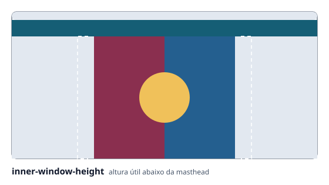
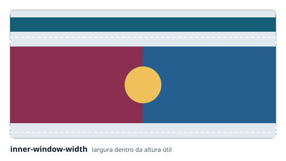

# COVER e Hero — modo de uso

Página canônica de autoria subordinada ao [`RCF-JCEM-CARREGAMENTO-PROGRESSIVO-001`](../RCFs/carregamento-progressivo.md) e derivada de [`config/cover-system.json`](../config/cover-system.json). Os campos legados `featured_image`, `featured_image_style` e `header.*` continuam válidos; `cover` especializa somente o que for declarado.

## Exemplo copiável e funcional

O front matter abaixo usa apenas assets versionados do repositório e produz uma COVER `wide triptych` com Hero central:

```yaml
---
layout: single
title: Exemplo de COVER editorial
featured_image:
  path: /assets/images/fixtures/covers/triptych-central.svg
  alt: Círculo dourado sobre transição vinho e azul
cover:
  mode: wide
  composition: triptych
  fit: auto
  patterns:
    left: /assets/images/fixtures/covers/triptych-left.svg
    right: /assets/images/fixtures/covers/triptych-right.svg
  hero:
    zone: center
    align: center
    valign: center
    max_width: 42rem
    protection: auto
    content: |
      ## Um título sobre a imagem

      Texto editorial curto e legível.
    cta:
      label: Continuar leitura
      url: "#inicio-do-artigo"
---
```

`featured_image.alt` descreve a mídia. `cover.hero.content` aceita Markdown sanitizado; o CTA somente é válido quando `label` e `url` estão presentes.

## Os dez comportamentos visuais

Todas as ilustrações usam `560×315`, a mesma janela, a mesma zona de artigo e a mesma linguagem visual. Elas mostram geometria e composição, não o conteúdo editorial da imagem.

| Comportamento | Aplicação e diferença material | Ilustração |
|---|---|---|
| Hero legado | `header.image` ou `featured_image` sem estilo explícito. Usa largura integral enquanto cabe no primeiro viewport e converge à zona do artigo quando a altura projetada excede a área disponível. |  |
| `content` | COVER contida exatamente na zona visível do artigo, em proporção `1200:630`, sem sangria lateral. |  |
| `wide single` | Uma imagem ocupa a altura canônica e é centralizada no viewport; somente o excesso horizontal é recortado simetricamente. |  |
| `wide triptych` | Centro `1200:630` acompanhado por patterns laterais contínuos e independentes. |  |
| `full-window` | COVER externa de `100svh`, iniciada atrás da masthead; ambos os eixos são contidos. |  |
| `window-height` | COVER externa de `100svh`; a altura governa a mídia. |  |
| `window-width` | COVER externa de `100svh`; a largura governa a mídia. |  |
| `inner-full-window` | Preenche a altura útil abaixo da masthead e contém os dois eixos. |  |
| `inner-window-height` | Usa a altura útil abaixo da masthead como dimensão governante. |  |
| `inner-window-width` | Usa a largura como dimensão governante dentro da altura útil abaixo da masthead. |  |

## Barra de título e FLAG

O Hero legado, `content`, `wide single` e `wide triptych` reservam a faixa terminal da mídia para a região superior de vidro fumê. Essa região sobrepõe a COVER exatamente pela própria altura, desfoca o conteúdo posterior e termina na fronteira em que começa a região inferior sólida. O título permanece exclusivamente na região inferior, em amarelo, sem sublinhado, borda ou ícone de link.

Nos seis modos de viewport (`full-window`, `window-height`, `window-width` e pares `inner-*`), a área governada permanece integral: o conjunto de título é posicionado depois dela, sem sobrepor a região superior. Em todos os modos, a FLAG continua pertencendo ao mesmo conjunto. Sua referência de apoio é a base horizontal do triângulo traseiro — cerca de `16,85%` abaixo do topo do `viewBox` nos SVGs atuais — e não o topo da caixa; essa linha coincide com o topo da região vítrea.

As ilustrações de Hero legado, `content`, `wide single` e `wide triptych` representam a sobreposição vítrea, a região inferior sólida e a sustentação da FLAG. As demais preservam a COVER de viewport integral, que precede essas barras no fluxo.

## Modos, aliases e composição

Prefira os nomes canônicos em novas publicações:

| Nome canônico | Escopo | Eixo | Aliases aceitos |
|---|---|---|---|
| `content` | artigo | contenção | `inline` |
| `wide` | janela | altura | `full`, `full-width`, `bleed` |
| `full-window` | externo, atrás da masthead | automático | `FullWindow`/`fullwindow` |
| `window-height` | externo, atrás da masthead | altura | `windowHeight`/`windowheight` |
| `window-width` | externo, atrás da masthead | largura | `windowWidth`/`windowwidth` |
| `inner-full-window` | interno, abaixo da masthead | automático | `innerFullWindow`/`innerfullwindow` |
| `inner-window-height` | interno, abaixo da masthead | altura | `innerWindowHeight`/`innerwindowheight` |
| `inner-window-width` | interno, abaixo da masthead | largura | `innerWindowWidth`/`innerwindowwidth` |

O campo legado `featured_image_style: wide`, `cover.mode: wide` (preferido para novas publicações) e os aliases `full`, `full-width` e `bleed` preservam a mesma geometria horizontal: a COVER ocupa a largura da janela, enquanto o conjunto de título continua alinhado à zona do artigo. A composição `single` mantém o crop central por altura; a sintaxe escolhida não reclassifica uma publicação `wide` como `content`.

`composition` aceita `single` ou `triptych`. A composição tripla só é válida em modos de janela; exige `patterns.left` e `patterns.right`. Cada pattern pode ser:

- path público de imagem versionada;
- hexadecimal de 3, 4, 6 ou 8 dígitos;
- `linear-gradient(...)` sem `url()` ou variável externa.

Os campos legados `header.image_wide_mode`, `header.image_wide_left` e `header.image_wide_right` continuam equivalentes na COVER `wide`. `fit` aceita `auto`, `contain` ou `cover`; ele altera o enquadramento, não cria um modo novo.

## Hero

Hero é uma camada opcional e ortogonal a qualquer COVER. Omiti-lo mantém a imagem, a geometria e o fluxo anteriores.

| Campo | Valores |
|---|---|
| `zone` | `top-left`, `top-right`, `bottom-left`, `bottom-right`, `center`, `full` |
| `align` | `auto`, `left`, `center`, `right` |
| `valign` | `auto`, `top`, `center`, `bottom` |
| `max_width` | número seguido por `ch`, `em`, `rem`, `px` ou `%` |
| `protection` | `auto`, `soft`, `strong`, `none` |

O conteúdo fica sempre na área útil central, nunca nos patterns. `auto` e `soft` usam proteção translúcida; `strong` reforça o fundo; `none` exige que a própria imagem ofereça contraste suficiente.

## Open Graph

`cover.og.wide_source` e `cover.og.square_source` são overrides sociais opcionais e devem apontar para imagens públicas existentes. Na ausência deles, o pipeline reutiliza as fontes legadas e gera `header.og_image` e `header.og_image_square`. O override social nunca troca a imagem visível da publicação.

## Manutenção

Mudança de modo, alias, composição, `fit`, pattern, Hero, geometria ou semântica exige atualização conjunta do RCF, desta página, da ilustração atingida e da validação documental.
