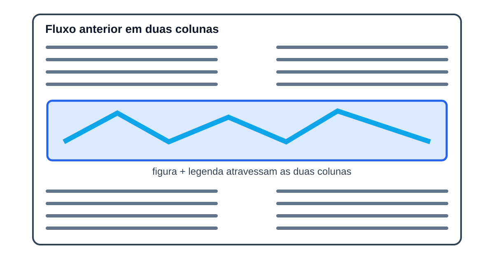

# Impressão editorial IEEE — modo de uso

Página canônica de uso subordinada ao [`RCF-JCEM-IMPRESSAO-IEEE-001`](../RCFs/impressao-ieee.md). O mesmo perfil `ieee-conference-a4-ieeetran-1.8b` atende desktop e mobile, sem seleção por user-agent, largura, orientação ou classe de dispositivo.

## Imprimir um artigo

1. Abra uma publicação individual.
2. Use o comando nativo **Imprimir** do navegador ou do sistema.
3. Selecione uma impressora ou **Salvar como PDF**.
4. Mantenha papel A4 e escala de 100% para corresponder ao perfil aferido.

O artigo impresso contém título, autoria, metadados, Resumo, Abstract, corpo em duas colunas, imagens/tabelas editoriais admitidas, lista final de URLs e bloco institucional. COVER, Hero, navegação, controles TTS, decoração web e modelos visuais de `blockquote` não integram a saída.

## Figuras em largura total

Use a largura total quando uma figura horizontal contém texto, rótulos, linhas, símbolos ou detalhes que perderiam legibilidade em uma coluna. Não use para fotografia, ilustração simples, decoração ou imagem alta. O recurso só atua na impressão IEEE; a página web conserva o mesmo tamanho e fluxo.



### Marcação manual

Para uma imagem Markdown sem legenda, acrescente o atributo Kramdown existente:

```markdown
{: data-print-span="all"}
```

Para manter imagem e legenda juntas, marque o `figure` ou a imagem interna. O build promove a decisão ao contêiner semântico:

```html
<figure data-print-span="all">
  
  <figcaption>Combinações lógicas da frase analisada.</figcaption>
</figure>
```

A decisão manual válida sempre prevalece. Para impedir a automarcação de uma ocorrência específica, use `data-print-span="column"` no `figure` ou na imagem.

### Automarcação conservadora

Durante `build:print`, o classificador analisa somente imagens locais referenciadas por artigos e páginas. Uma figura só recebe largura total quando satisfaz, ao mesmo tempo:

1. orientação horizontal e altura projetada de no máximo 35% da área útil A4;
2. evidência textual ou visual inequívoca;
3. decisão determinística da versão registrada do classificador.

SVGs usam estrutura textual e gráfica analisada por `jsdom`; rasters usam estatísticas e bordas do `sharp/libvips`. Proporção horizontal isolada nunca basta. O cache em `.jekyll-cache/jcem-print-full-width.json` é identificado pelo SHA-256 do asset, perfil, configuração e versão: fonte inalterada não é reanalisada, e qualquer mudança relevante invalida o resultado.

Na impressão, o fluxo anterior encerra a linha de colunas, a figura respeita as margens e o aspect ratio, e o texto posterior retoma as duas colunas. Não há duplicação, reposicionamento absoluto nem JavaScript pós-layout.

## Desktop e mobile

A capacidade é a mesma em desktop e mobile. O navegador móvel pode apresentar o destino como impressão, compartilhamento ou exportação PDF conforme o sistema e a impressora disponíveis; essa diferença de interface não altera perfil, conteúdo nem configuração preparados pelo site.

Nenhuma heurística de user-agent, largura, orientação, toque ou DPR desativa o recurso. Quando um navegador não oferecer impressão/PDF, o artigo permanece legível e o fallback é uma limitação registrada do ambiente, não uma versão reduzida do produto.

## Carregamento pós-crítico

Os endereços dos dois CSS de impressão chegam como metadados inertes e não iniciam download no caminho crítico. Depois de `window.load`, fontes e imagens editoriais relevantes, o conector agenda CSS, módulo e preparação por `requestIdleCallback`; navegadores sem essa API usam uma fila assíncrona por `MessageChannel`, sem atraso fixo.

`beforeprint` e `matchMedia('print')` preemptam essa espera quando a impressão começa cedo. Falha de CSS, módulo, fonte ou imagem não oculta nem substitui o artigo HTML.

## Verificação técnica

```powershell
npm run check:print
npm run check:print:full-width
npm run check:performance
npm run build:prod
$env:JCEM_SITE_ROOT='_site'; npm run check:print:runtime
```

Os comandos validam perfil, API, isolamento, classificação de figuras, cache, metadados inertes, agendamento e desempenho. Após o build, `check:print:runtime` confirma em navegador real os perfis desktop/mobile e a rede sem assets IEEE antes da fase pós-crítica. A inspeção visual deve ainda conferir retrato/paisagem, claro/escuro, impressão antecipada e retomada das colunas após figuras largas.
